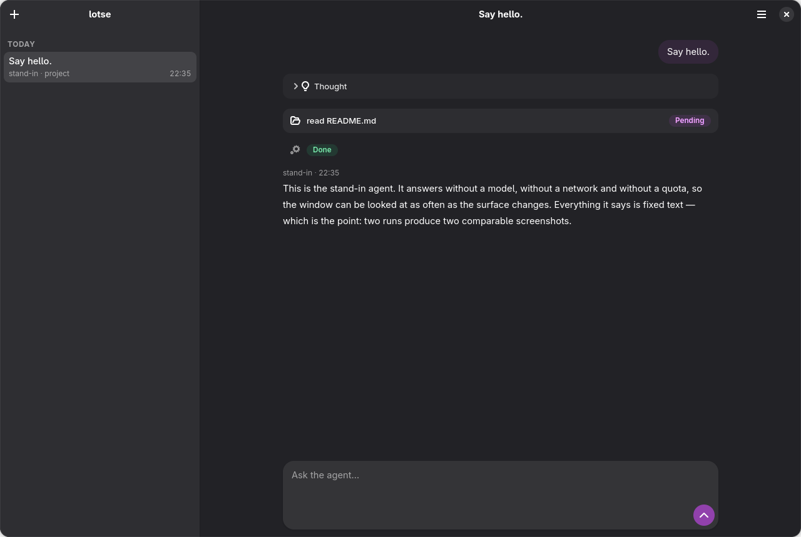
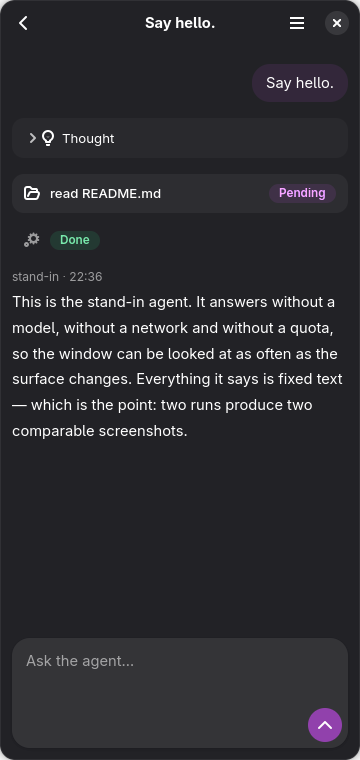
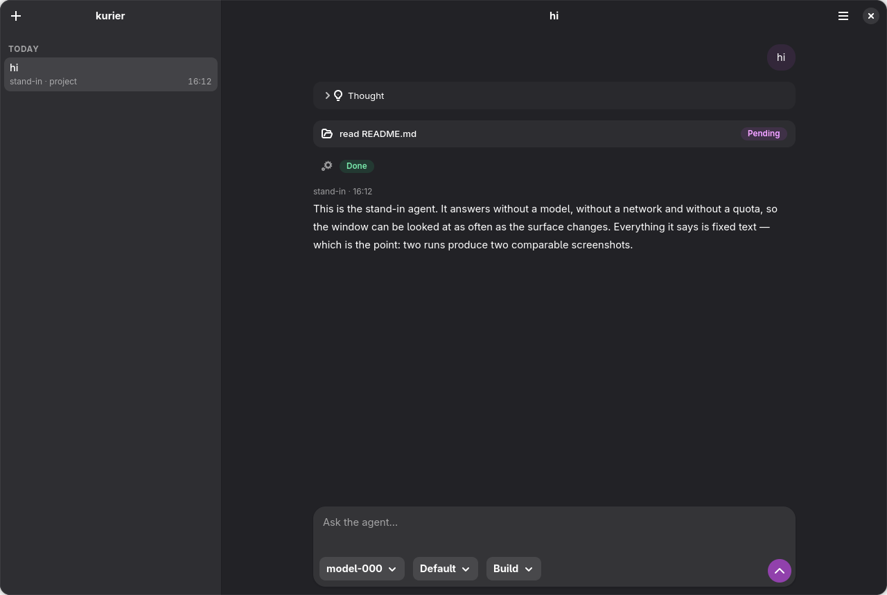
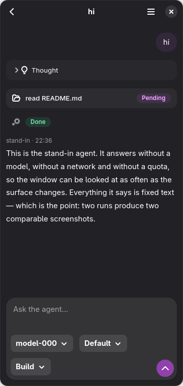
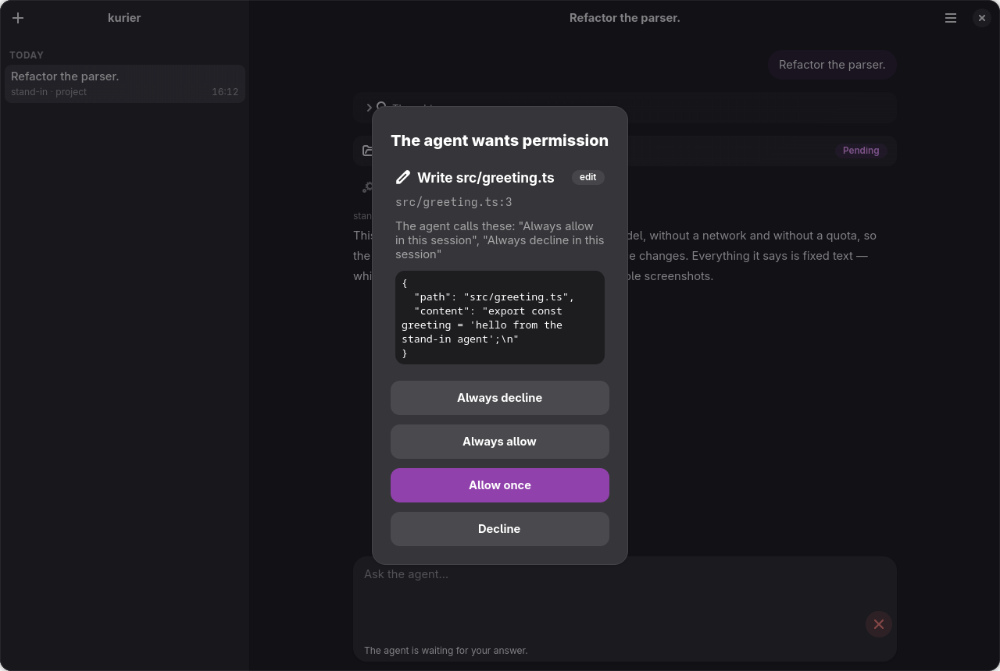
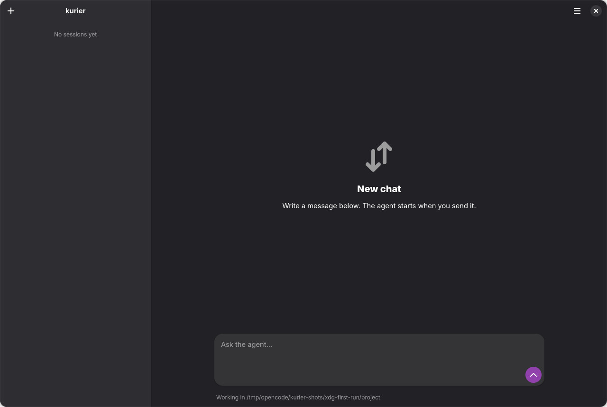
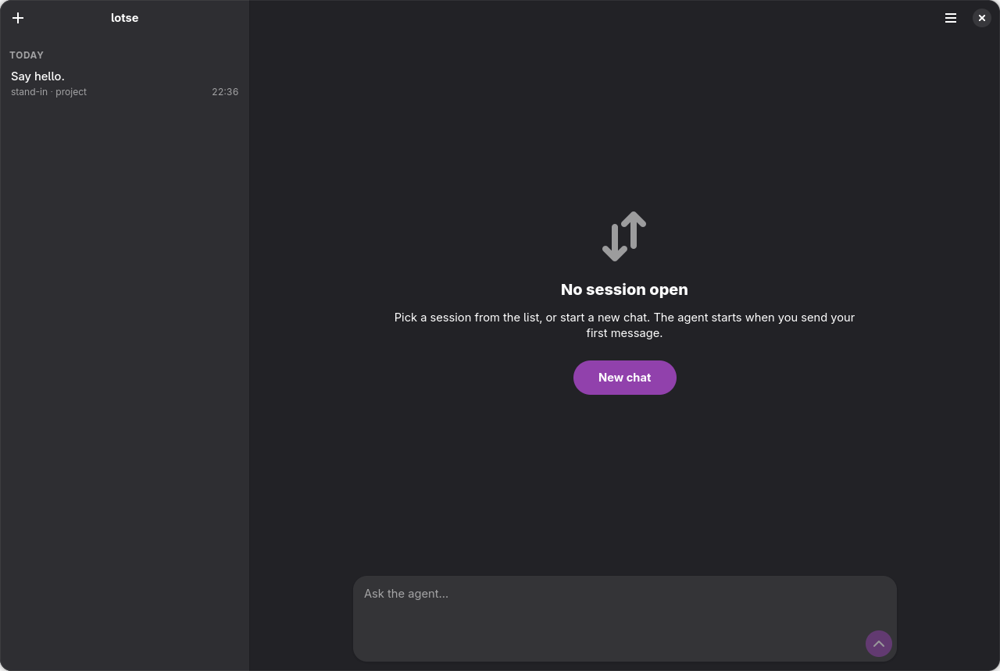
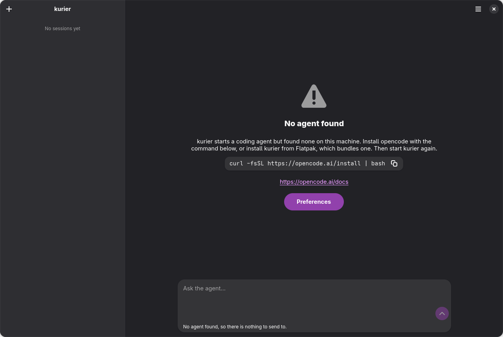
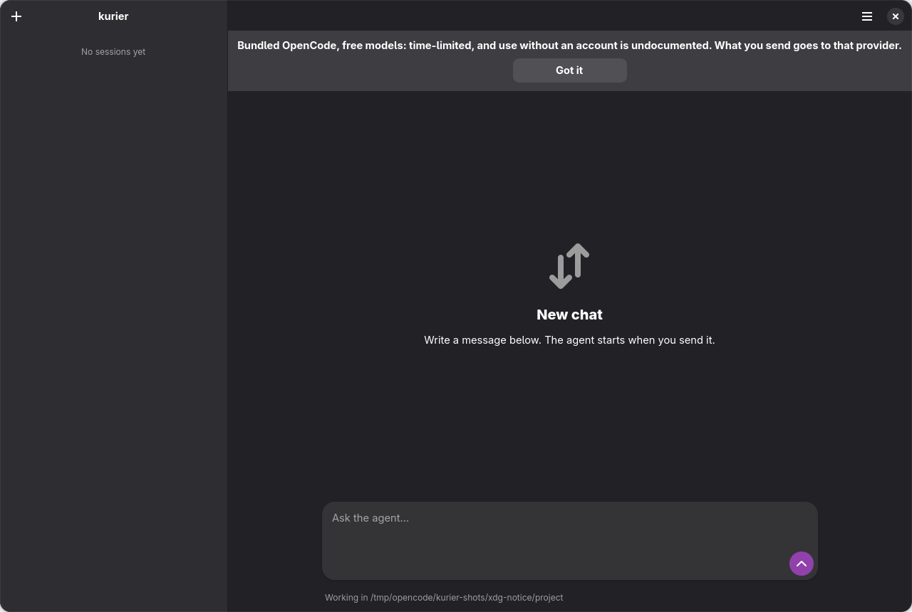
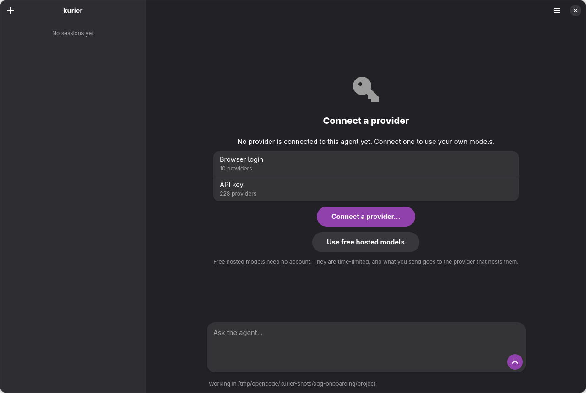

# GUI design

The kurier window follows the GNOME HIG and libadwaita. Its layout borrows from established chat
apps (Claude, ChatGPT, LibreChat): one reading column, quiet chrome, one composer. This look is
the baseline `@lotse/widget` inherits ([ADR 0001](../adr/0001-lotse-as-an-embeddable-widget.md)).

## Principles

- **One reading column.** The transcript sits in an `Adw.Clamp`. Prompts are right-aligned
  bubbles; agent replies are unboxed body text under a small caption (agent · time).
- **One composer card.** The entry, the model / effort / mode dropdowns and a round Send button
  share one floating card. The dropdowns wrap at the 360 px window floor; they never overflow.
- **Cards only for machinery.** Tool calls and the agent's thinking are quiet, collapsible cards
  with a status pill. A tool line that carries only a status is a caption, not a card.
- **Calm empty states.** Compact status pages with one action and no feature tours.
- **Adwaita first.** Style classes and named colors before custom CSS. The custom CSS lives as
  named classes in `app/src/frontends/gui/css.ts`, so light and dark both work.
- **Visuals only.** The redesign kept the permission-dialog response order, focus, the default
  response, fail-closed answers, hooks, the transcript format and Enter / Shift+Enter unchanged.

## Screenshots

Shot on a headless mutter against the stand-in agent and a synthetic home under `/tmp`, so no
real path or conversation appears. The stand-in agent and the dev hooks that reach each state are
in [dev-fixtures.md](../dev-fixtures.md).

| State | 1280 px | 360 px |
|---|---|---|
| Conversation with thought and tool cards |  |  |
| Composer with model, effort and mode |  |  |
| Permission request |  | |
| First run (new chat) |  | |
| Start with earlier chats, none open |  | |
| No agent found |  | |
| Notice banner |  | |
| Provider onboarding (no provider connected) |  | |
